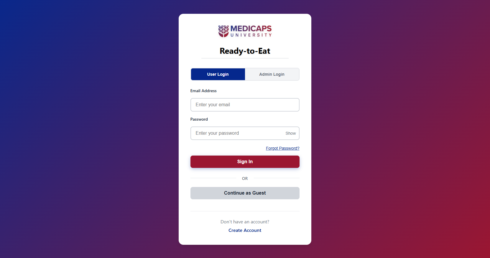
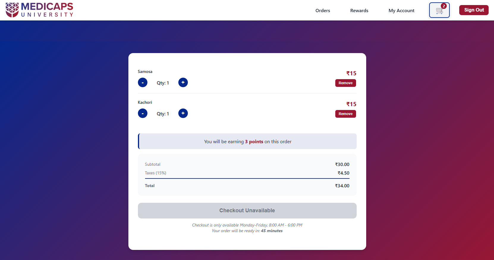
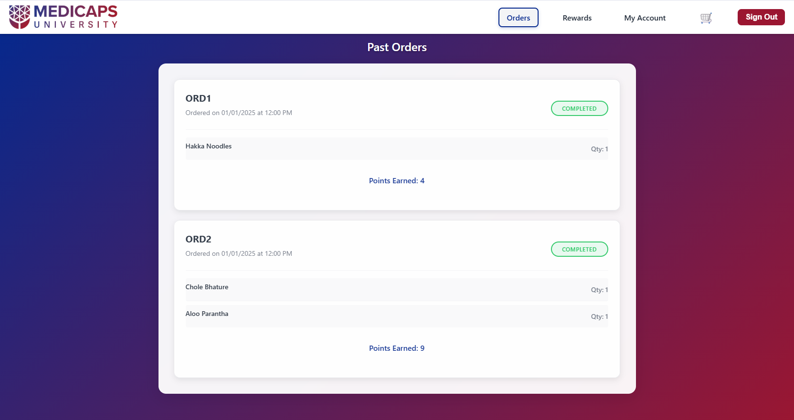
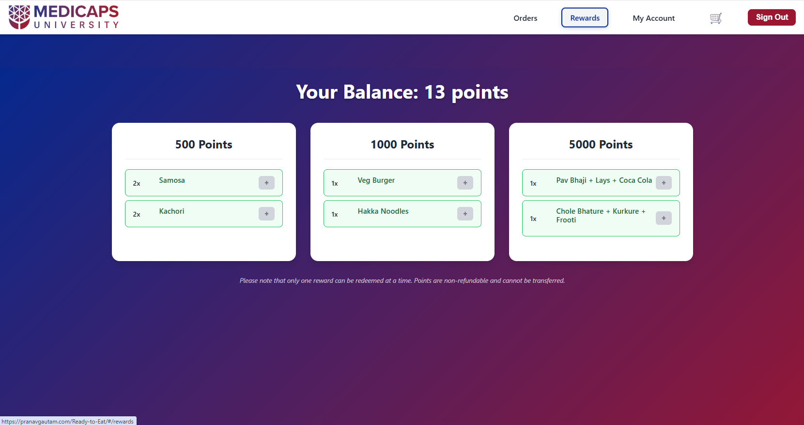
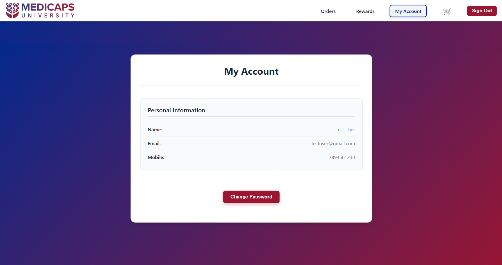
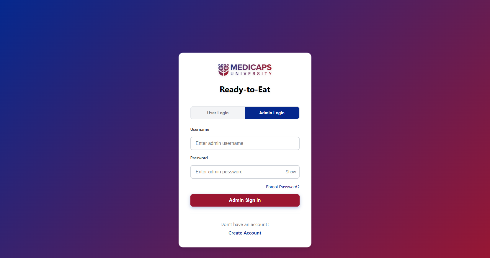
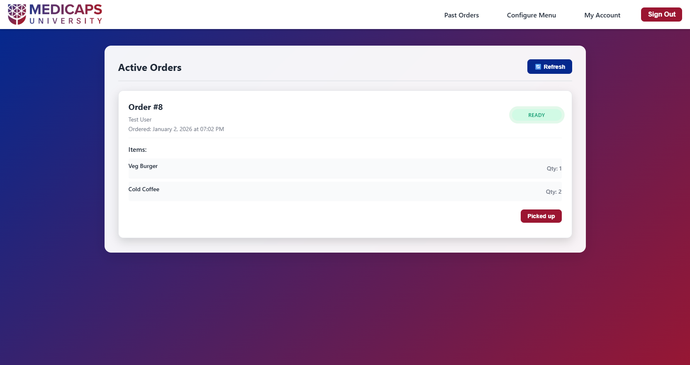
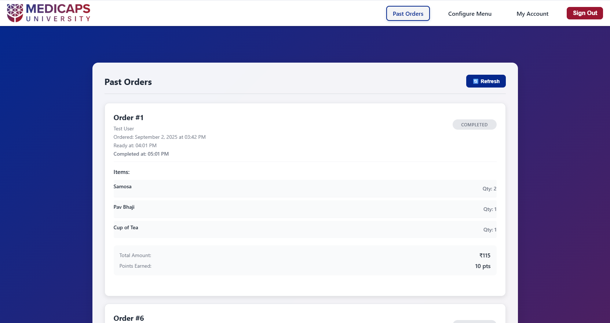
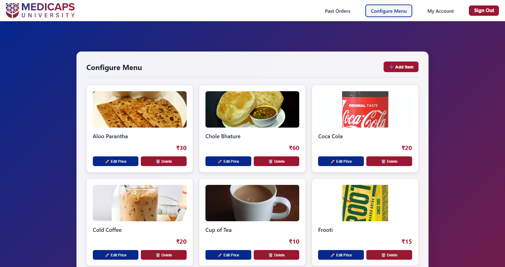
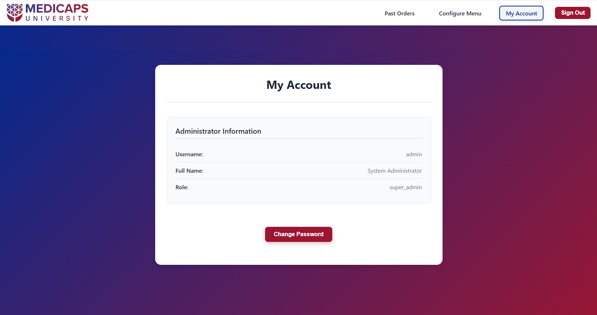

# Ready-to-Eat 🍽️

<div align="center">

**Full-Stack Food Ordering Platform | Campus Dining Made Easy**

[](https://flask.palletsprojects.com/)
[](https://reactjs.org/)
[](https://www.python.org/)
[](https://www.mysql.com/)
[](https://developer.mozilla.org/en-US/docs/Web/JavaScript)

*Revolutionizing campus dining with seamless ordering, real-time tracking, and integrated rewards*

</div>

---

**Ready-to-Eat** is a modern, full-stack food ordering platform designed exclusively for Medi-Caps University's cafeteria. Built with React.js and Flask, this application revolutionizes the campus dining experience by providing students and faculty with a seamless, digital solution for ordering food. From browsing the menu to tracking orders and earning rewards, Ready-to-Eat brings convenience and efficiency to campus dining.

The platform features a beautiful, intuitive user interface with real-time order tracking, an integrated rewards system, and comprehensive admin tools for managing the cafeteria operations. Whether you're a student grabbing a quick snack between classes or an administrator managing daily operations, Ready-to-Eat streamlines the entire food ordering process.

## 🌟 Features

### For Students & Faculty

#### 1. Secure Authentication & Access

The application provides multiple ways to access the platform, ensuring convenience while maintaining security:

- **User Login**: Students and faculty can create accounts with email and password authentication
- **Admin Login**: Dedicated login portal for cafeteria administrators
- **Guest Access**: Quick access for users who want to place orders without creating an account (limited features)
- **Password Recovery**: Secure password reset functionality via email
- **Session Management**: Secure session-based authentication with automatic logout



*The login page features a clean, modern design with separate tabs for user and admin access, along with a guest access option for quick ordering.*

#### 2. Menu Browsing & Discovery

Browse through the complete cafeteria menu with an intuitive, visually appealing interface:

- **Visual Menu Display**: All food items are displayed in an attractive grid layout with high-quality images
- **Detailed Information**: Each item shows its name, price, and appetizing photos
- **Easy Navigation**: Simple, responsive design that works seamlessly on desktop and mobile devices
- **Real-time Availability**: Menu items reflect current availability and pricing


*The menu page showcases all available food items in a clean grid layout, making it easy for users to browse and select their favorite meals. Each item displays its price and an "Add to Cart" button for quick ordering.*

#### 3. Shopping Cart & Order Management

A comprehensive cart system that makes ordering simple and transparent:

- **Add to Cart**: Easily add multiple items to your cart with quantity controls
- **Cart Management**: Adjust quantities or remove items before checkout
- **Order Summary**: View subtotal, taxes (15%), and total amount before placing an order
- **Points Preview**: See how many reward points you'll earn before completing your order
- **Estimated Ready Time**: Know exactly when your order will be ready (typically 45 minutes)
- **Time-based Checkout**: Checkout is available Monday-Friday, 8:00 AM - 6:00 PM



*The shopping cart page displays all selected items with quantity controls, order summary including taxes, and shows the points you'll earn. The checkout button is only available during business hours.*

#### 4. Order History & Tracking

Keep track of all your orders with detailed history and status updates:

- **Past Orders**: View complete history of all your previous orders
- **Order Details**: See order date, time, items, quantities, and total amount
- **Order Status**: Track the current status of your orders (Pending, Preparing, Ready, Completed)
- **Points Tracking**: View points earned for each completed order
- **Order Identification**: Each order has a unique identifier (ORD1, ORD2, etc.) for easy reference



*The Past Orders page displays your complete order history with order dates, items, quantities, and the points earned for each completed order. Each order is clearly labeled and organized for easy reference.*

#### 5. Rewards & Points System

An integrated loyalty program that rewards users for every order:

- **Points Earning**: Earn points automatically with every order (points based on order value)
- **Points Balance**: Always see your current points balance at the top of the rewards page
- **Reward Tiers**: Multiple reward tiers available (500, 1000, and 5000 points)
- **Flexible Redemption**: Redeem points for individual items or combo meals
- **Reward Options**: 
  - 500 Points: 2x Samosa, 2x Kachori
  - 1000 Points: 1x Veg Burger, 1x Hakka Noodles
  - 5000 Points: Combo meals (Pav Bhaji + Lays + Coca Cola, Chole Bhature + Kurkure + Frooti)



*The Rewards page shows your current points balance and all available redemption options organized by point tiers. Users can easily add rewards to their cart using the "+" buttons.*

#### 6. Account Management

Complete control over your account information and settings:

- **Personal Information**: View and manage your profile details
- **Account Details**: Access your name, email, and mobile number
- **Password Management**: Change your password securely at any time
- **Profile Updates**: Keep your information up to date



*The My Account page displays all your personal information in a clean, organized layout with easy access to password change functionality.*

### For Administrators

#### 1. Admin Authentication

Secure login portal exclusively for cafeteria administrators:

- **Dedicated Admin Login**: Separate login interface for administrators with username-based authentication
- **Admin Credentials**: Secure authentication system with role-based access control
- **Session Management**: Secure session-based authentication for admin operations
- **Access Control**: Only authorized administrators can access the admin panel



*The admin login page provides a dedicated interface for cafeteria administrators. It features a clean design with separate tabs for user and admin login, allowing administrators to securely access the management panel.*

#### 2. Active Orders Management

Real-time order tracking and management for current orders:

- **Live Order Monitoring**: View all active orders in real-time with automatic status updates
- **Order Status Tracking**: Monitor orders through different stages (Pending, Preparing, Ready)
- **Order Details**: View complete order information including customer name, order time, items, and quantities
- **Status Updates**: Update order status as they progress through the preparation process
- **Pick-up Confirmation**: Mark orders as "Picked up" once customers collect their orders
- **Refresh Functionality**: Manual refresh button to update order status instantly



*The Active Orders page displays all current orders with their status, customer information, items, and quantities. Administrators can update order status and mark orders as picked up once collected by customers.*

#### 3. Past Orders & History

Complete order history and analytics for administrative purposes:

- **Historical Data**: Access complete history of all past orders
- **Order Analytics**: View order dates, ready times, completion times, and customer information
- **Financial Tracking**: See total amounts for each order
- **Points Tracking**: Monitor points earned by customers for each order
- **Order Status**: View final status of all completed orders
- **Order Identification**: Each order has a unique identifier for easy reference and lookup



*The Past Orders page provides administrators with a comprehensive view of all completed orders, including order details, timestamps, items, total amounts, and points earned by customers.*

#### 4. Menu Configuration

Complete menu management system for cafeteria operations:

- **Add Menu Items**: Add new food items to the menu with images, names, and prices
- **Edit Pricing**: Update prices for existing menu items quickly and easily
- **Delete Items**: Remove items from the menu when they're no longer available
- **Visual Management**: View all menu items with their images in an organized grid layout
- **Real-time Updates**: Changes to the menu are immediately reflected in the user interface
- **Bulk Operations**: Manage multiple menu items efficiently from a single interface



*The Configure Menu page allows administrators to manage the entire cafeteria menu. Each item displays with its image, name, and price, along with "Edit Price" and "Delete" buttons for quick management. A prominent "+ Add Item" button enables adding new items to the menu.*

#### 5. Admin Account Management

Administrator profile and account settings:

- **Profile Information**: View administrator account details including username, full name, and role
- **Account Details**: Access role information (super_admin) and account identification
- **Password Management**: Change administrator password securely
- **Account Security**: Maintain secure access to the administrative panel



*The Admin My Account page displays all administrator information including username, full name, and role. Administrators can change their password to maintain account security.*

## 🚀 Quick Start (Local Development)

### Prerequisites
- Python 3.8+ 
- Node.js 14+
- MySQL 5.7+ or MySQL 8.0+
- Git

### 1. Clone the Repository
```bash
git clone <your-repo-url>
cd Ready-to-Eat
```

### 2. Backend Setup

#### Option A: Using Virtual Environment (Recommended)
```bash
# Create and activate virtual environment
python -m venv venv

# Windows
venv\Scripts\activate

# macOS/Linux
source venv/bin/activate

# Install dependencies
cd backend
pip install -r requirements.txt
```

#### Option B: Using System Python
```bash
cd backend
pip install -r requirements.txt
```

### 3. Database Setup
1. **Install MySQL** and start the service
2. **Create database**:
   ```sql
   CREATE DATABASE ready_to_eat;
   ```
3. **Run setup script**:
   ```bash
   mysql -u root -p ready_to_eat < ../database/setup.sql
   ```
4. **Update database credentials** in `backend/config.py` if needed

### 4. Start Backend Server
```bash
cd backend
python app.py
```
The API will be available at `http://localhost:5000`

### 5. Frontend Setup
```bash
# In a new terminal
cd frontend
npm install
npm start
```
The application will open at `http://localhost:3000`

## 👥 Test Accounts

### Admin Account
- **Username**: `admin`
- **Password**: `Admin123!`
- **Role**: Super Admin
- **Full Name**: System Administrator

### Test User
- **Email**: `testuser@gmail.com`
- **Password**: `Password123!`
- **Name**: Test User
- **Mobile**: 7894561230

## 🛠️ Technologies Used

- **Backend**: Python Flask, SQLAlchemy, PyMySQL
- **Frontend**: React.js, React Router, Axios
- **Database**: MySQL
- **Styling**: CSS3 with modern design principles
- **Authentication**: Session-based with password hashing
- **API**: RESTful API with JSON responses

## 📄 License

This project is licensed under the MIT License - see the LICENSE file for details.

## 🤝 Contributing

1. Fork the repository
2. Create a feature branch
3. Make your changes
4. Test thoroughly
5. Submit a pull request

---

**Ready-to-Eat** - Making campus dining convenient and efficient! 🎓🍕
